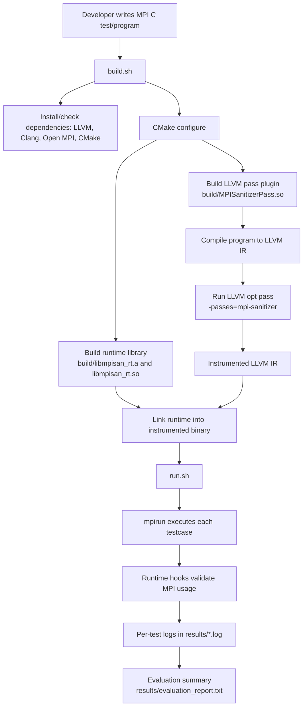
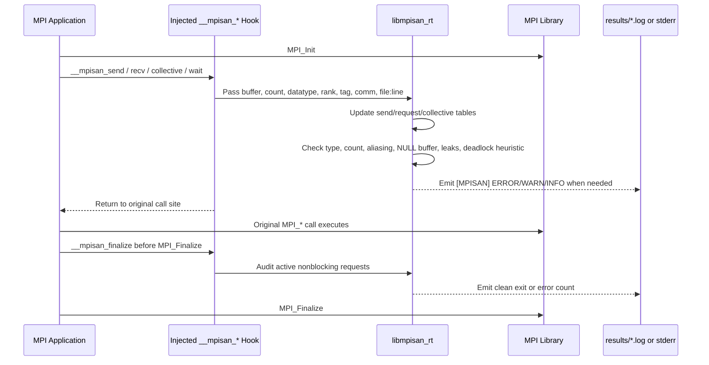
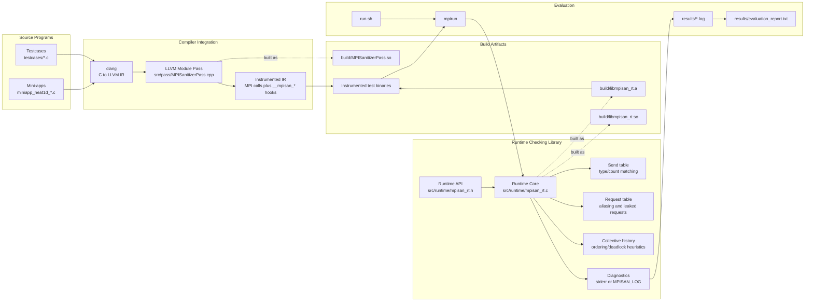
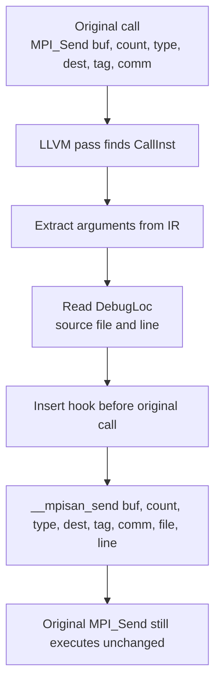

# MPI Sanitizer Workflow and Architecture

This document summarizes the intended build, instrumentation, runtime checking,
and evaluation flow for the Compiler-Integrated MPI Usage Sanitizer.

## Project Workflow

## Runtime Execution Workflow

## Architecture Diagram

## Main Components

| Component | Path | Responsibility |
|---|---|---|
| LLVM pass | `src/pass/MPISanitizerPass.cpp` | Scans LLVM IR for `MPI_*` / `PMPI_*` calls and injects runtime hooks before them. |
| Runtime API | `src/runtime/mpisan_rt.h` | Declares hook functions used by instrumented IR. |
| Runtime implementation | `src/runtime/mpisan_rt.c` | Maintains MPI metadata tables, performs checks, and emits diagnostics. |
| Build script | `build.sh` | Installs dependencies, configures CMake, builds pass/runtime, and builds testcase binaries. |
| Test runner | `run.sh` | Runs correct, buggy, deadlock, and mini-app tests under `mpirun`; writes logs and report. |
| Test suite | `testcases/*.c` | Contains clean examples, seeded MPI bugs, and heat1d mini-app variants. |

## Instrumentation Flow

The same pattern is used for `MPI_Recv`, `MPI_Isend`, `MPI_Irecv`,
`MPI_Wait`, `MPI_Waitall`, `MPI_Barrier`, supported collectives, and
`MPI_Finalize`.

## Detection Responsibilities

| Bug class | Runtime hook/check |
|---|---|
| Type mismatch | Record sends in the send table; compare matching receives by datatype. |
| Count mismatch | Compare receive count against recorded send count. |
| Buffer aliasing | Compare new nonblocking buffer ranges with active request ranges. |
| Leaked request | Scan active request table during `__mpisan_finalize`. |
| NULL buffer | Check pointer arguments before MPI call executes. |
| Collective misuse | Record collective operation history per communicator. |
| Deadlock-prone sends | Apply a local rank-ordering heuristic for blocking sends. |

## Important Build Note

The sanitizer only detects MPI misuse when test/program binaries are actually
instrumented by `MPISanitizerPass.so` and linked with `libmpisan_rt.a`. Merely
linking `libmpisan_rt.a` into an otherwise normal MPI binary is not enough,
because the runtime is entered through compiler-injected `__mpisan_*` calls.
